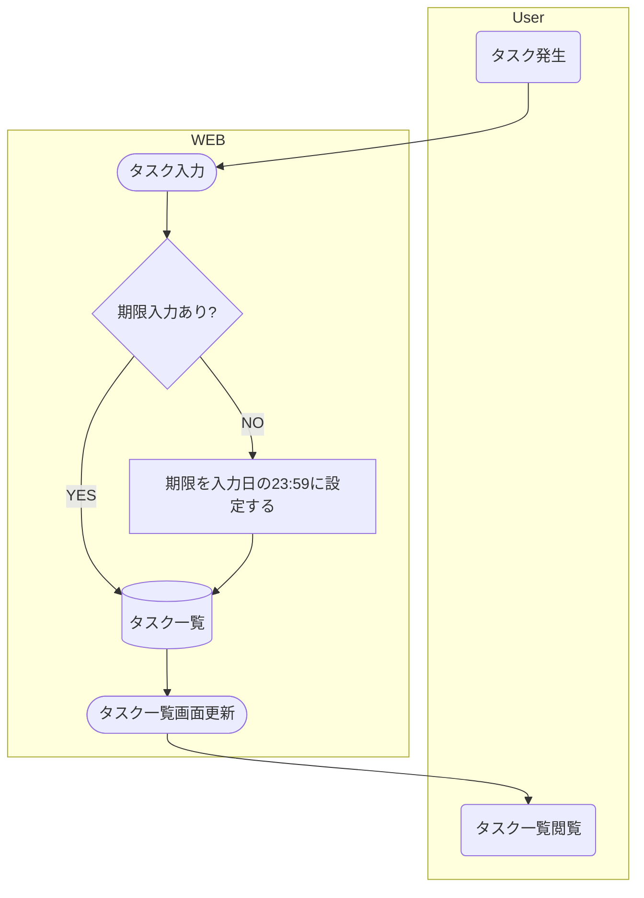
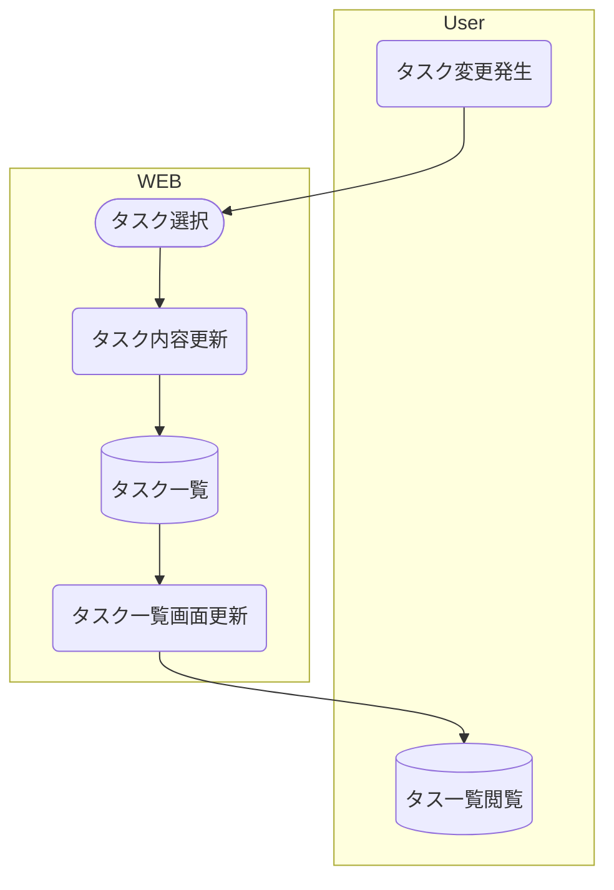

## 基本設計書

### このドキュメントの位置づけ
ググるとよく出る基本設計書の内容を記載する
業務フロー（操作フロー），機能一覧，構成図（デプロイ構成，アーキテクチャ構成図）
テーブル定義，画面遷移図，画面レイアウト図

## 目次
- [基本設計書](#基本設計書)
  - [このドキュメントの位置づけ](#このドキュメントの位置づけ)
- [目次](#目次)
- [業務用兼](#業務用兼)
- [システムフロー](#システムフロー)
  - [タスク新規作成](#タスク新規作成)
    - [タスク編集(完了含む)](#タスク編集完了含む)
- [機能一覧](#機能一覧)
- [構成図](#構成図)
  - [デプロイ構成図](#デプロイ構成図)
  - [アーキテクチャ図](#アーキテクチャ図)
- [テーブル定義](#テーブル定義)
- [画面遷移図](#画面遷移図)
- [画面レイアウト図](#画面レイアウト図)

## 業務用兼
要件については 要件定義書.mdに記載

## システムフロー

### タスク新規作成

#### タスク編集(完了含む)

## 機能一覧

## 構成図

### デプロイ構成図

### アーキテクチャ図

## テーブル定義

## 画面遷移図

## 画面レイアウト図
