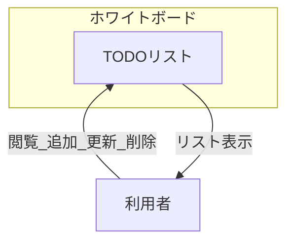
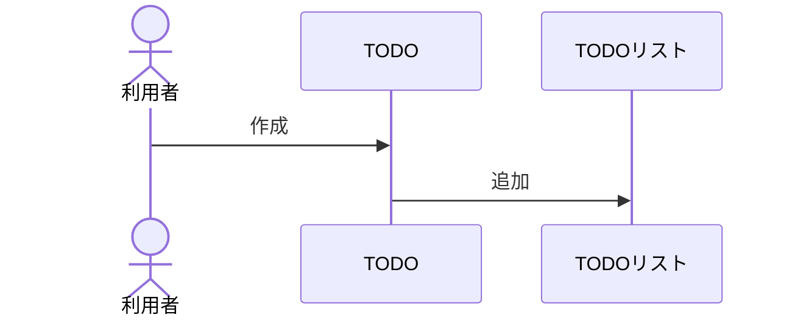
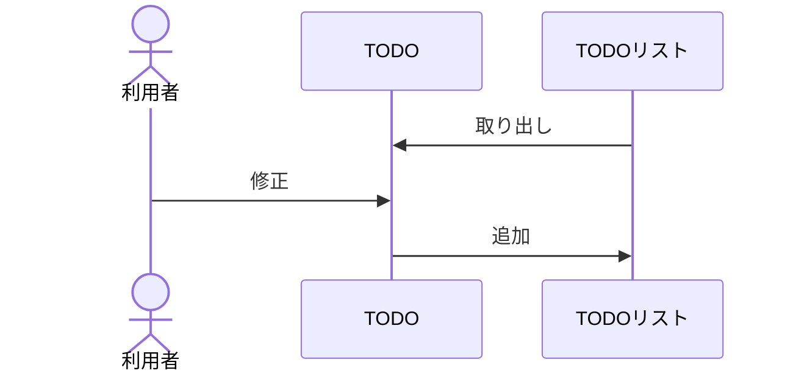
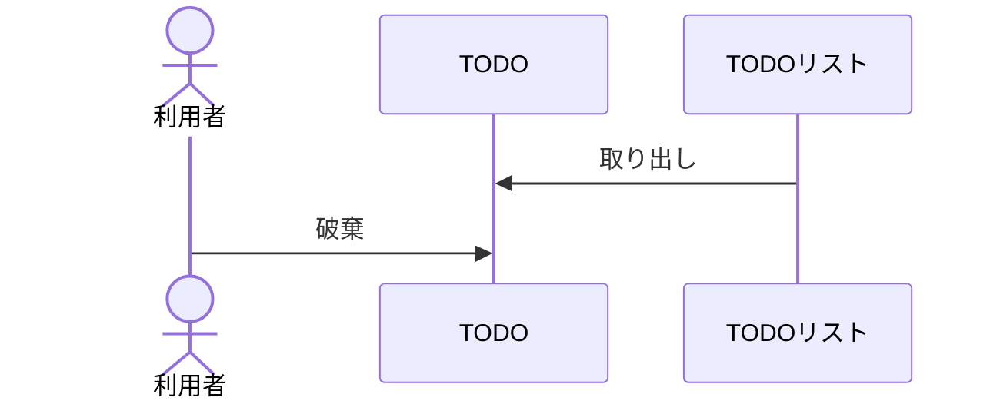
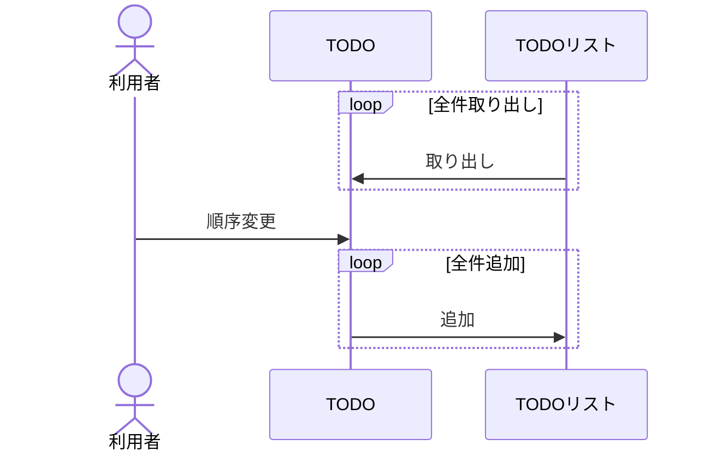

# Web TODO 要件定義書

#### このドキュメントの位置づけ  
依頼者から渡された現在の業務内容と  
作成してほしいシステムの仕様を書いてもらったもの

## 目次
- [Web TODO 要件定義書](#web-todo-要件定義書)
      - [このドキュメントの位置づけ](#このドキュメントの位置づけ)
  - [目次](#目次)
  - [要求概要](#要求概要)
    - [システム化の背景と目的](#システム化の背景と目的)
      - [目的](#目的)
      - [背景](#背景)
      - [狙い](#狙い)
    - [用語の定義](#用語の定義)
  - [システムの要件](#システムの要件)
    - [システム化の範囲](#システム化の範囲)
    - [現状の業務手順](#現状の業務手順)
      - [タスクの発生](#タスクの発生)
      - [タスクの完了](#タスクの完了)
      - [タスクの優先順位整理](#タスクの優先順位整理)
    - [タスクの修正](#タスクの修正)
    - [業務関連図](#業務関連図)
    - [業務機能要件](#業務機能要件)
  - [現行の業務フロー](#現行の業務フロー)
      - [追加操作](#追加操作)
      - [更新操作](#更新操作)
      - [削除操作](#削除操作)
      - [並べ替え操作](#並べ替え操作)

---

## 要求概要

### システム化の背景と目的

#### 目的

外出先でもTODOリストを閲覧できるようにすることを目的として  
TODリストをインターネット上で閲覧編集できるよう，システムを新規構築する

#### 背景

* 現在TODOリストを付箋とホワイトボードで運用しているが外出先で閲覧することができない．
* 扱うタスクが増え，スペース的にこれ以上TODOの追加ができなくなることが予想される．
  * 定期的に行っている優先順位付けの時間が今以上に伸びることも予想される
* 期限を決めないタスクを作ってしまい，優先順位のを間違えたり締め切り超過してしまうなどの深刻な課題となっている．

#### 狙い

* どこでもTODOリストを閲覧・編集できることにより外出先でのタスク忘れの現象
* 優先順位付けのミス現象
* 締め切り超過タスクの現象
* タスクの管理可能数を2倍増加
* TODO優先順位付けの時間削減

### 用語の定義

|          |                                                                             | 
| -------- | --------------------------------------------------------------------------- | 
| 用語     | 説明                                                                         | 
| TODOリスト | 今回開発対象のシステム                                                      | 
| 利用者   | TODOリストを閲覧・編集する人                                                  | 
| TODO     | TODOリスト内の１項目 現在は付箋を使っている                                    | 
| タスク   | TODOに書き込む内容                                                            | 
| 締め切り | 利用者がタスクごとに設定した日時 １つのTODOに対して１つの締め切りを設定する       | 
|          |                                                                             | 

---

## システムの要件

### システム化の範囲

本システムで開発する対象は現状の業務全体のシステム化である．
外部への通知やTODOリストの共有などの付加機能は対象外とする

### 現状の業務手順

#### タスクの発生
1. (発生)利用者にがタスクを思いつく
2. 利用者がタスクをTODOに変換する
3. 利用者がTODOリストにTODOを追記する(任意で締め切りを設定する)
4. TODOリストに追加したTODOが表示される

#### タスクの完了
1. (発生)利用者がTODOのタスクを終わらせる
2. 利用者がTODOリストから完了したTODOをTODOリストから削除する
3. TODOリストからTODOが消える

#### タスクの優先順位整理
1. (発生)週に一度実施する
2. TODOリストにあるタスクを締め切り順に並べ替える
3. 締め切りのないタスクについては，内容と利用者の記憶を頼りに並べ替える
4. TODOリストのTODOの並びが利用者が手を付ける順番に表示される

### タスクの修正
1. (発生)TODOの内容に間違いや変更・締め切りの変更が発生したとき
2. TODOリストから対象のTODOを選ぶ
3. TODO内のタスク・締め切りを書き換える
4. TODOリストのTODOの内容が更新される

### 業務関連図

### 業務機能要件

* TODOリスト追加機能
  * TODOをTODOリストへ追加する
* TODOリスト更新機能
* TODOリスト削除機能
* TODOリスト並べ替え機能

---

## 現行の業務フロー

#### 追加操作

---
#### 更新操作

---
#### 削除操作

---
#### 並べ替え操作

